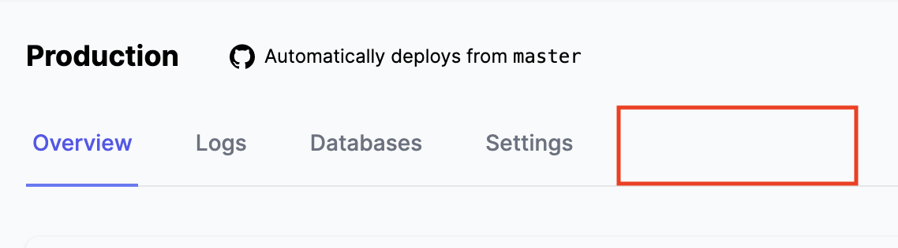
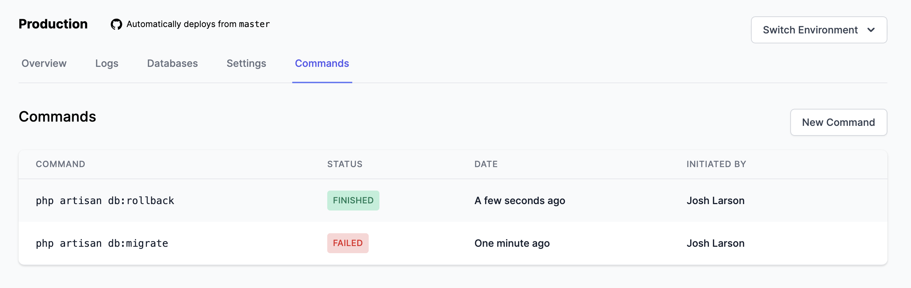
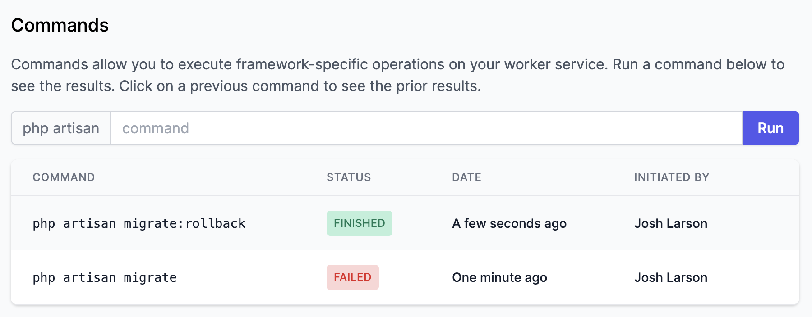

This is heavily inspired by [Laravel Vapor](https://vapor.laravel.com), where you can fire off a command to a worker service. It hooks into framework-specific CLI utilities like `php artisan` for Laravel, `rails` for Rails, and `wp` for WordPress.

### April 28, 2020

- Decided that Rafter will expose a **Commands** UI that allows a user to create a new `Command` model, which is then dispatched via HTTP to the worker service
- Did lots of research on how to properly authenticate the request to the non-public worker service. If you're using a GCP service like Cloud Tasks or PubSub, it's super easy because Google handles authenticating with the receiving service just fine. However, we need to call this synchronous request ourselves and consume the response to display it to the user. This means we need to [sign the request ourselves with an OIDC token](https://cloud.google.com/run/docs/authenticating/service-to-service).
- Found a [useful code snippet](https://cloud.google.com/iap/docs/authentication-howto#authenticating_from_a_service_account) in the GCP docs for their IAP service (which we aren't actually using). But it demonstrates how you can leverage the Google-provided `ApplicationDefaultCredentials` class to take care of all the messy JWT signing. All you have to do is pass an `audience` parameter (which, in this case, is the URL of the worker Cloud Run service), and you get an OIDC token ✨.

Let's start with the **Laravel Rafter Core** integration, since that's the easiest. In the service provider for the Laravel package, I [register the worker-specific routes](https://github.com/rafter-platform/laravel-rafter-core/blob/594cadcec5891114cbe905208a350a0b68d1e332/src/RafterServiceProvider.php#L59-L62):

```php
Route::group(['middleware' => [VerifyGoogleOidcToken::class, EnsureRafterWorker::class]], function () {
    Route::post(Rafter::QUEUE_ROUTE, 'Rafter\Http\Controllers\RafterQueueWorkerController');
    Route::post(Rafter::SCHEDULE_ROUTE, 'Rafter\Http\Controllers\RafterScheduleRunController');
});
```

- The `VerifyGoogleOidcToken` middleware is custom-built to verify an incoming request contains the proper Authorization header....
- And now that I type all of this out, I realize this probably isn't even necessary 🙈 since Google Cloud Run already authenticates the request. D'oh.

Anyway, carrying on. I'm adding a new route to the `Rafter` class:

```php{5}
class Rafter
{
    const QUEUE_ROUTE = '/_rafter/queue/work';
    const SCHEDULE_ROUTE = '/_rafter/schedule/run';
    const COMMAND_ROUTE = '/_rafter/command/run';
```

As well as a new route in the service provider, pointing to a new `RafterCommandRunController`:

```php
namespace Rafter\Http\Controllers;

use Illuminate\Http\Request;
use Illuminate\Routing\Controller;
use Illuminate\Support\Facades\Artisan;

class RafterCommandRunController extends Controller
{
    public function __invoke(Request $request)
    {
        Artisan::call($request->command);
        return Artisan::output();
    }
}
```

It's pretty straightforward:

- It uses the `Artisan` Facade to call a given command that is passed in through a request parameter
- Then it returns the output of the command, also using the `Artisan` facade.

Time to test this baby out! I have a [Rafter Laravel Example](https://github.com/rafter-platform/rafter-example-laravel) project locally that I'll use.

- First, I'll borrow [Caleb Porzio's `composer-link` bash alias](https://calebporzio.com/bash-alias-composer-link-use-local-folders-as-composer-dependancies/) to mount the local package into the project:

```bash
composer-link ../laravel-rafter-core
```

- **Update**: This didn't work 🙃 because I'm already referencing a package published on Packagist.
- Instead, I had to add the git repository and reference `dev-{branch}` e.g. `dev-commands` as the version name, and then run `composer update`. Thanks to [this blog post](https://lornajane.net/posts/2014/use-a-github-branch-as-a-composer-dependency)!

And my curl test worked great 🎉:

```bash
curl -d '{"command": "list"}' -H "Content-Type: application/json" -X POST http://rafter-example-laravel.test/_rafter/command/run
Laravel Framework 7.9.2

Usage:
  command [options] [arguments]

Options:
  -h, --help            Display this help message
  -q, --quiet           Do not output any message
  -V, --version         Display this application version
      --ansi            Force ANSI output
      --no-ansi         Disable ANSI output
  -n, --no-interaction  Do not ask any interactive question
      --env[=ENV]       The environment the command should run under
  -v|vv|vvv, --verbose  Increase the verbosity of messages: 1 for normal output, 2 for more verbose output and 3 for debug

Available commands:
  clear-compiled       Remove the compiled class file
  ...
```

[⚡️ I've opened a PR for the Laravel Core Package here](https://github.com/rafter-platform/laravel-rafter-core/pull/1).

Next, let's focus on the **Rafter integration**. This will be a little more work:

- Let's have fun with some **UI-Driven Development**. How do we want the Commands UI to look?
- I'm sure we'll want to add a tab under the `environments.show` partial:



- This is a simple thing to add, but where do we point? Probably something like `projects.environments.commands.index`? I'm really not digging these nested paths. I'm not married to this setup. I'm also not a huge fan of having to create a controller and a view just to render a couple lines of a component, probably Livewire.
- Livewire author [Caleb Porzio demonstrated a Route helper](https://laravel-livewire.com/screencasts/s1-setting-up-the-component) in a recent screencast. I wonder if I can start taking advantage of this, and use Livewire primarily for these small settings screens and tabs without having to use controllers?
- Or maybe I just use anonymous, inline functions instead?

Meh, I'll do an inline function:

```php
// Commands
Route::get('projects/{project}/environments/{environment}/commands', function (\App\Project $project, \App\Environment $environment) {
    return view('environments.commands', [
        'project' => $project,
        'environment' => $environment,
    ]);
})
    ->name('projects.environments.commands.index');
```

I hate it already. Onward!

- Let's mock up what we want the commands index to look like. Probably a table of some sort, similar to our deployments list table.
- WAIT... this probably needs to be paginated. And I would be remiss if we built this without using Livewire's fancy AJAX pagination. Let's just make `CommandsList` a Livewire component 😈

```bash
php artisan make:livewire CommandsList
```

Then let's try simplifying the route:

```php
Route::livewire('projects/{project}/environments/{environment}/commands', 'commands-list')
    ->layout('components.environment')
    ->name('projects.environments.commands.index');
```

- Ugh. Update: this approach requires you to use a traditional Laravel layout file with stuff like `@yield('content')`. I'm using a newer component-based layout approach, using `{{ $slot }}`.
- I'm just gonna switch back to using a normal view, which renders a Livewire component.

Here's `environments/commands.blade.php`

```html
<x-layout>
  <x-environment :project="$project" :environment="$environment">
    <x-subtitle>Commands</x-subtitle>

    <livewire:commands-list :environment="$environment" />
  </x-environment>
</x-layout>
```

And the `CommandsList.php` Livewire component:

```php
<?php

namespace App\Http\Livewire;

use App\Environment;
use Livewire\Component;

class CommandsList extends Component
{
    public $environment;

    public function mount(Environment $environment)
    {
        $this->environment = $environment;
    }

    public function render()
    {
        return view('livewire.commands-list');
    }
}
```

And here's some inital UI, stubbed out with fake data:



I dig it so far!

- Next, let's work on the **new command** view.
- Again, I'm torn on how I want this to work.
- It could be a simple Blade template with a form which POSTs to a controller, and redirects the user to a `show` page with the results.
- But I want this to feel _interactive_, as in: when you click **Run**, you see some sort of a spinner

_Several hours later..._

- OK I originally planned to make this a synchronous action, shying away from the notion that I might make this an asynchronous `DispatchCommand` job.
- However, making it an async job makes my UI decision a bit easier: I'll create the command, dispatch it onto a queue, and immediately redirect the user to the `commands.show` page. This will be another Livewire component which polls for updates to the output.
- Plus, you have to think that _sometime_ a user is going to run a super lengthy artisan command. We want Rafter to _feel fast_ even if their worker service is _slow_.

OK - with these plans in mind, let's start in on a new view for **New Commands**.

- I think I'm gonna make it a Livewire component for the hell of it. Might add some cool functionality later on, like autocompleting commands based on project, etc. Plus this is going to contain some logic, e.g. prepending the `php artisan` for the user alongside the input.
- ~Adding a new view and route for `commands.show`.~ NOPE... let's just add the input to the top of `commands.index` for simplicity.

At the top of my existing `CommandsList` Livewire component, I've added a new form:

```html
<div class="mb-4">
  <form wire:submit.prevent="runCommand">
    <label for="command" class="sr-only">
      Run a new command
    </label>
    <div class="mt-1 flex rounded-l-md shadow-sm">
      <span
        class="inline-flex items-center px-3 rounded-l-md border border-r-0 border-gray-300 bg-gray-50 text-gray-500 border-r-0"
      >
        php artisan
      </span>
      <input
        wire:model="newCommand"
        id="command"
        class="form-input flex-1 block w-full px-3 py-2 rounded-none sm:leading-5 autofocus"
        placeholder="command"
      />
      <span class="inline-flex rounded-r-md shadow-sm">
        <button
          type="submit"
          class="inline-flex items-center px-4 py-2 border border-transparent leading-5 font-medium rounded-r-md text-white bg-indigo-600 hover:bg-indigo-500 focus:outline-none focus:border-indigo-700 focus:shadow-outline-indigo active:bg-indigo-700 transition ease-in-out duration-150"
        >
          Run
        </button>
      </span>
    </div>
  </form>
</div>
```

Looks pretty spiffy:



- Now to actually wire this thing up.
- This will be an actual controller route and Blade view - handy for being able to link to existing commands.
- Let's go ahead and create the `Command` model, controller, and other fun stuff:

```bash
php artisan make:model Command -a
```

Here's my migration:

```php
Schema::create('commands', function (Blueprint $table) {
    $table->id();
    $table->unsignedBigInteger('environment_id')->index();
    $table->unsignedBigInteger('user_id');
    $table->string('command');
    $table->longText('output')->nullable();
    $table->string('status')->default('pending');
    $table->timestamps();

    $table->foreign('environment_id')
        ->references('id')->on('environments')
        ->onDelete('cascade');
});
```

And let's generate a `CommandOutput` Livewire component:

```bash
php artisan make:livewire CommandOutput
```

`CommandOutput.php` is going to accept the `Command` as its only argument:

```php
<?php

namespace App\Http\Livewire;

use App\Command;
use Livewire\Component;

class CommandOutput extends Component
{
    public $command;

    public function mount(Command $command)
    {
        $this->command = $command;
    }

    public function render()
    {
        return view('livewire.command-output');
    }
}
```

Let's add a view, `environments.commands.show`, to house the new component. Something like this:

```html
<x-layout>
  <x-environment :project="$project" :environment="$environment">
    <x-subtitle>Command: <code>{{ $command->command }}</code></x-subtitle>

    <livewire:command-output :command="$command" />
  </x-environment>
</x-layout>
```

Now let's chat about the flow for actually creating and dispatching a command:

1. User enters new command in the index view and clicks the **Run** button (or presses Enter).
1. Livewire fires the `runCommand` method, which creates a new `Command` model, and fires the `$command->dispatch()` method on the model.
1. Livewire redirects the user to `commands.show` which will show the `CommandOutput` component. It will poll for the status and display the output when ready.
1. The model then marks itself as pending with `$this->markPending()`, and dispatches a new `DispatchCommand` job.
1. Inside the job, a signed request is made to the worker URL with the `command` payload of the current `Command`.
1. The response is returned and recorded in `$command->update([ 'output' => $responseBodyText ])`
1. The command is marked has having succeeded with `$command->markFinished()`. We also want to handle any error cases, designating with `$command->markFailed()`.
1. The output is automatically displayed to the user inside the Livewire component.

So all of these things are pretty straightforward, except for this:

> Inside the job, a signed request is made to the worker URL with the `command` payload of the current `Command`.

It's gonna involve several moving pieces. Let's start from the top, though.

Moving back to our creation form, let's define some logic inside the `runCommand` method:

```php
public function runCommand()
{
    $this->authorize('update', $this->environment);

    $this->validate([
        'command' => ['required', 'string'],
    ]);

    $command = $this->environment->commands()->create([
        'command' => $this->command,
        'user_id' => request()->user()->id,
    ]);

    $command->dispatch();

    return redirect()->route('projects.environments.commands.show', [
        $this->environment->project,
        $this->environment,
        $command
    ]);
}
```

_Gosh I really dislike these nested routes. I might change them sometime to be flat._

Cool. Time to run my migrations and... try this out?

💥 **Issue: Mass-assignment**. Sigh.

Let's update our `Command` model to remove mass-assignment protection and add some helper methods while we're at it:

```php
<?php

namespace App;

use Illuminate\Database\Eloquent\Model;

class Command extends Model
{
    const STATUS_PENDING = 'pending';
    const STATUS_RUNNING = 'running';
    const STATUS_FINISHED = 'finished';
    const STATUS_FAILED = 'failed';

    protected $guarded = [];

    public function dispatch()
    {
        # code...
    }

    public function markRunning()
    {
        $this->update(['status' => static::STATUS_RUNNING]);
    }

    public function markFinished(string $output)
    {
        $this->update([
            'status' => static::STATUS_FINISHED,
            'output' => $output,
        ]);
    }

    public function markFailed(string $output)
    {
        $this->update([
            'status' => static::STATUS_FAILED,
            'output' => $output,
        ]);
    }
}
```

✨OK my redirect is working at least. I'll move on to new steps tomorrow 🌄.
