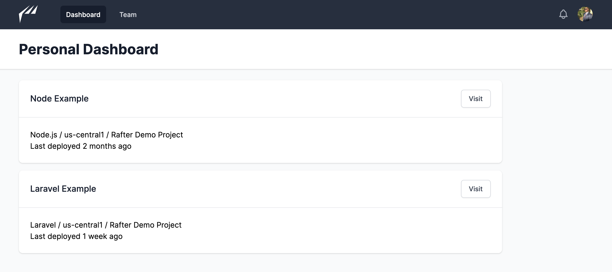
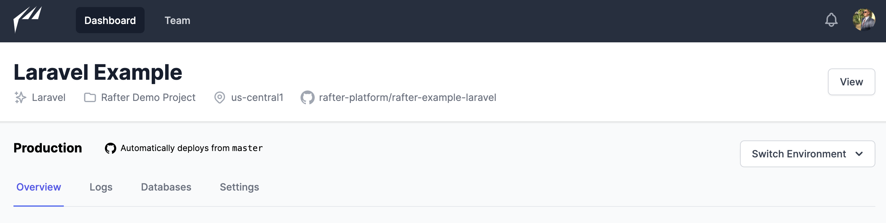
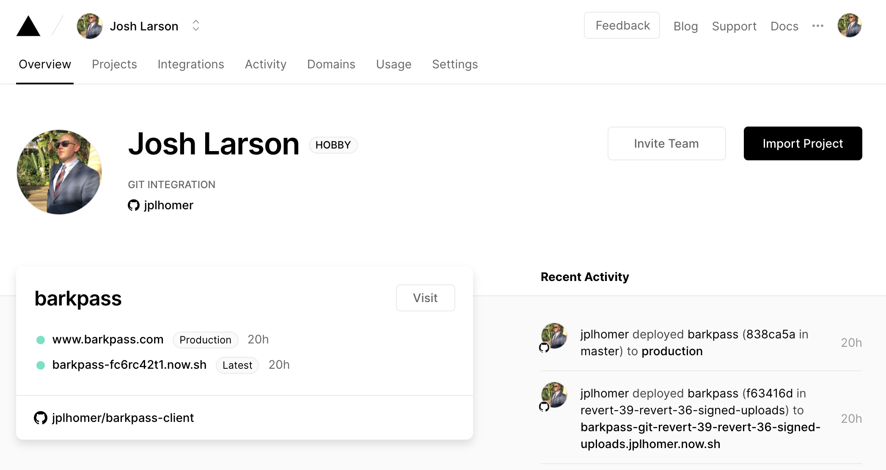
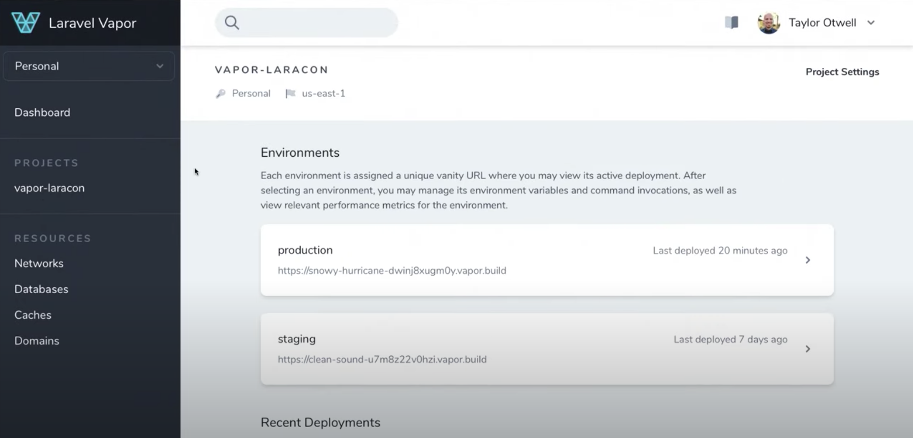

I'm building the interface of Rafter with [Tailwind UI](https://tailwindui.com)! Follow along.

## April 22, 2020

Here's what I have so far!

I'm using the [Dark nav with white page header](https://tailwindui.com/components/application-ui/application-shells/stacked#component-10058606cac5398d7fa2c73b64089874) layout from Tailwind UI. I really like this so far - it's concise and it seems like it will be brandable to whichever color/font selections I might eventually want to use.

My main focus so far has been on the **Project/Environment page**:

My biggest inspirations so far have been [Vercel](https://vercel.com) (fka Zeit):

And [Laravel Vapor](https://vapor.laravel.com):

- I really like the simplicity of Vercel
- Vapor places a big emphasis on the concept of an **Environment**. I'm torn - it feels like an extra step to send the user through a list of environments before selecting an "environment detail" which is more like the "project detail" page in Vercel
- As a compromise, I think I'll redirect the user to live on the `production` environment by default.
- Heroku does some interesting things here, but it's a little more closely tied to the concept of a "pipeline"
