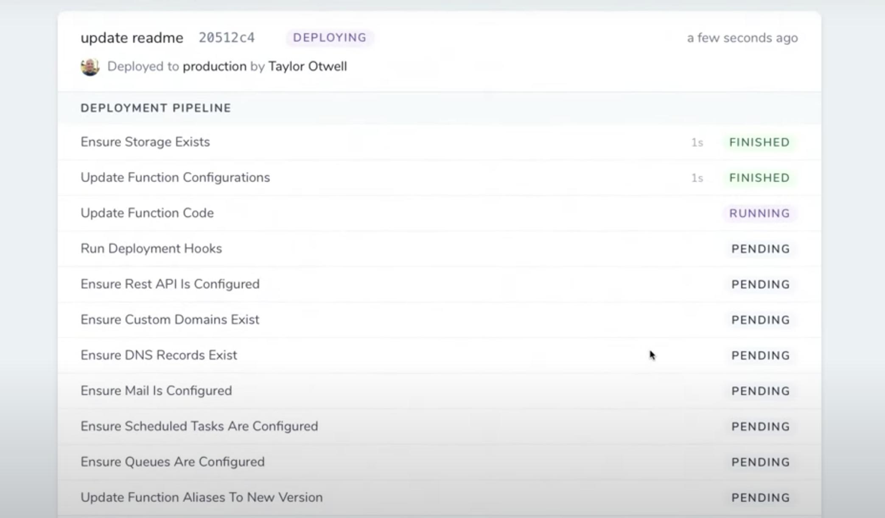

When Taylor Otwell introduced [Laravel Vapor](https://vapor.laravel.com) at Laracon 2019, he showcased a really neat UI for displaying a "Deployment Pipeline" ([check it out in this video](https://www.youtube.com/watch?v=XsPeWjKAUt0&t=1120s)):



This is a great way to represent a sequence of chained jobs, so I borrowed this UI concept to build the **Deployment Status** view inside [Rafter](https://github.com/rafter-platform/rafter-alpha):


It's powered by [Laravel](https://laravel.com/)'s batteries-included Queue logic, and I wanted to share with you how it's built!

👋 _Curious about Rafter? Read my [introductory post](/what-is-rafter/) to learn more._

## Getting Started: Chained Jobs

Laravel supports [Job Chaining](https://laravel.com/docs/7.x/queues#job-chaining) out of the box:

```php
ProcessPodcast::withChain([
    new OptimizePodcast,
    new ReleasePodcast
])->dispatch();
```

It's a nice, fluent way of saying "Run these jobs sequentially after the previous one is complete."

This is perfect for Rafter!

For an initial deployment of a project, you might expect the chain of jobs to look something like this:

_Note: This uses the new [`dispatchChain` method](https://github.com/laravel/framework/blob/7.x/src/Illuminate/Support/Facades/Bus.php#L43) added in Laravel 7 ✨_

```php
Bus::dispatchChain([
    new StartDeployment($deployment),
    new CreateImageForDeployment($deployment),
    new ConfigureQueues($deployment),
    new WaitForImageToBeBuilt($deployment),
    new CreateCloudRunService($deployment),
    new WaitForCloudRunServiceToDeploy($deployment),
    new UpdateCloudRunServiceWithUrls($deployment),
    new WaitForCloudRunServiceToDeploy($deployment),
    new EnsureAppIsPublic($deployment),
    new StartScheduler($deployment),
    new FinalizeDeployment($deployment)
]);
```

Unfortunately, these queued jobs are **not recorded permanently** in the database as normal records.

So how do we go from a normal job chain to a list of jobs inside our database so we can display them in the web app?

## Introducing Tracked Jobs

We'll accomplish this by creating a `TrackedJob`. It's a standard queued job which inherits some extra properties:

- It is recorded in the database as an Eloquent model
- It has a name, e.g. "Start Deployment"
- It has a status (pending, started, finished, failed)
- It tracks when it was started and finished
- It is attached to another Eloquent model (in this case, `Deployment`)

Additionally, in Rafter, we want to be able to **persist the output of any given job** and display it to the user (as seen in the screenshot). So we'll add this as an additional requirement.

Let's start by creating the model along with a migration:

```bash
php artisan make:model TrackedJob -m
```

And we'll give the table some columns:

```php
Schema::create('tracked_jobs', function (Blueprint $table) {
    $table->bigIncrements('id');
    $table->unsignedBigInteger('trackable_id')->index();
    $table->string('trackable_type')->index();
    $table->string('name');
    $table->string('status')->default('queued');
    $table->longText('output')->nullable();
    $table->timestamp('started_at')->nullable();
    $table->timestamp('finished_at')->nullable();
    $table->timestamps();
});
```

We've defined two interesting columns here: `trackable_id` and `trackable_type`. This leverages Laravel's [One-to-Many Polymorphic Relations](https://laravel.com/docs/7.x/eloquent-relationships#one-to-many-polymorphic-relations).

The benefit of doing this instead of, for example, `deployment_id` is that we can use `TrackedJobs` with more than just `Deployment` if we want!

Now, let's look at a typical job like `StartDeployment`:

```php
namespace App\Jobs;

use Illuminate\Bus\Queueable;
use Illuminate\Contracts\Queue\ShouldQueue;
use Illuminate\Foundation\Bus\Dispatchable;
use Illuminate\Queue\InteractsWithQueue;
use Illuminate\Queue\SerializesModels;

class StartDeployment implements ShouldQueue
{
    use Dispatchable, InteractsWithQueue, Queueable, SerializesModels;

    protected $deployment;

    public function __construct($deployment)
    {
        $this->deployment = $deployment;
    }

    public function handle()
    {
        $this->deployment->markAsInProgress();
    }
}
```

The job is simple:

1. Accept an instance of `Deployment`
1. Mark it as in-progress

Now let's take the time to **track this job** using our new `TrackedJob` model.

First, we'll want to establish that polymorphic relationship that we scoped out in our database migration. These jobs serve as "deployment steps" for a given `Deployment`, so let's call the relationship `steps`:

```php
// Deployment.php

public function steps()
{
    return $this->morphMany('App\TrackedJob', 'trackable');
}
```

Next, we want to **create** the `TrackedJob` in the constructor of our job:

```php{5,10-12}
class StartDeployment implements ShouldQueue
{
    // ...

    protected $trackedJob

    public function __construct($deployment)
    {
        $this->deployment = $deployment;
        $this->trackedJob = $this->deployment->steps->create([
            'name' => 'StartDeployment',
        ]);
    }

    public function handle()
    {
        $this->deployment->markAsInProgress();
    }
}
```

Since we'll be displaying the **duration** of a given job, we want to keep track of the **start time** and **end time** of our job. Let's add some logic to the `TrackedJob` model to make this a breeze:

```php
namespace App;

use Illuminate\Database\Eloquent\Model;

class TrackedJob extends Model
{
    const STATUS_STARTED = 'started';
    const STATUS_FINISHED = 'finished';
    const STATUS_FAILED = 'failed';

    protected $guarded = [];

    protected $casts = [
        'started_at' => 'datetime',
        'finished_at' => 'datetime',
    ];

    public function trackable()
    {
        return $this->morphTo('trackable');
    }

    public function markAsStarted()
    {
        $this->update([
            'status' => static::STATUS_STARTED,
            'started_at' => now(),
        ]);
    }

    public function markAsFinished()
    {
        $this->update([
            'status' => static::STATUS_FINISHED,
            'finished_at' => now(),
        ]);
    }
}
```

We'll use these handy methods in our job:

```php{7,11}
class StartDeployment implements ShouldQueue
{
    // ...

    public function handle()
    {
        $this->trackedJob->markAsStarted();

        $this->deployment->markAsInProgress();

        $this->trackedJob->markAsFinished();
    }
}
```

This feels really nice so far!

It's flexible enough that I could also run a job that needed to be released periodically until it was ready to move on, e.g. `WaitForImageToBeBuilt`:

```php
class WaitForImageToBeBuilt implements ShouldQueue
{
    // ...

    public function handle()
    {
        $this->trackedJob->markAsStarted();

        if (!$this->deployment->imageIsBuilt()) {
            $this->release(15);
            return;
        }

        $this->trackedJob->markAsFinished();
    }
}
```

## Handling Failures

Besides manually releasing jobs, we'll also need to handle **failures** from time to time. Maybe it's an API error, or maybe Google Cloud is down, or maybe something is funky with one of our configurations.

Regardless, let's wrap our operation in a `try / catch` and update our `TrackedJob` accordingly:

```php
use Throwable;

class StartDeployment implements ShouldQueue
{
    // ...

    public function handle()
    {
        $this->trackedJob->markAsStarted();

        try {
            $this->deployment->markAsInProgress();

            $this->trackedJob->markAsFinished();
        } catch (Throwable $e) {
            $this->fail($e);
        }
    }

    public function failed()
    {
        $this->deployment->markAsFailed();
        $this->trackedJob->markAsFailed();
    }
}
```

We make sure to fire the native Laravel job `$this->fail()` method so the rest of the chain doesn't try to run.

Then we can stick our failure logic within a `failed()` method, which Laravel automatically calls when the job fails.

And let's add the `markAsFailed` helper to the model:

```php
class TrackedJob extends Model
{
    const STATUS_STARTED = 'started';
    const STATUS_FINISHED = 'finished';
    const STATUS_FAILED = 'failed';

    // ...

    public function markAsFailed()
    {
        $this->update([
            'status' => static::STATUS_FAILED,
            'finished_at' => now(),
        ]);
    }
}
```

## Recording the output

I mentioned that an additional requirement for Rafter was to be able to record the output of any given job.

We'll do that by adding a handy utility method to our model and making the appropriate updates to the job.

First, let's define a `setOutput` method on the model:

```php
// TrackedJob.php

public function setOutput($output)
{
    $this->update(['output' => $output]);
}
```

This can be used by longer-running jobs to give additional context to the user, e.g. pointing to Cloud Build output logs inside the Google Cloud Platform console.

Next, we'll update the `markAsFinished` and `markAsFailed` methods to accept and store output as well:

```php{10,20}
// TrackedJob.php

public function markAsFinished($output = '')
{
    $this->update([
        'status' => static::STATUS_FINISHED,
        'finished_at' => now(),
    ]);

    $this->setOutput($output);
}

public function markAsFailed($exception)
{
    $this->update([
        'status' => static::STATUS_FAILED,
        'finished_at' => now(),
    ]);

    $this->setOutput($exception);
}
```

Finally, we'll pass the output context to these methods in our job:

```php{10,19}
// StartDeployment.php

public function handle()
{
    $this->trackedJob->markAsStarted();

    try {
        $this->deployment->markAsInProgress();

        $this->trackedJob->markAsFinished('Optional job output here...');
    } catch (Throwable $e) {
        $this->fail($e);
    }
}

public function failed()
{
    $this->deployment->markAsFailed();
    $this->trackedJob->markAsFailed($exception->getMessage());
}
```

## Refactoring to Traits and Middleware

Our implementation so far _works_, but there are a couple downsides:

- Our job class has a bunch of logic related to `TrackedJob` which crowds the _actual_ job responsibility
- It can't be shared by other job classes — we'd have to copy and paste it for each additional step

So let's refactor this by moving it to a [trait](https://www.php.net/manual/en/language.oop5.traits.php)!

I'll create a new file in `app/Jobs` called `Trackable`:

```php
namespace App\Jobs;

use Throwable;

trait Trackable
{
    /**
     * The model associated with the job.
     */
    public $model;

    /**
     * TrackedJob tied to this job.
     *
     * @var \App\TrackedJob
     */
    public $trackedJob;

    public function __construct($model)
    {
        $this->model = $model;

        $this->trackedJob = TrackedJob::create([
            'trackable_id' => $this->model->id,
            'trackable_type' => get_class($this->model),
            'name' => class_basename(static::class),
        ]);
    }

    /**
     * Handle the job failing by marking the deployment as failed.
     *
     * @param Throwable $exception
     * @return void
     */
    public function failed(Throwable $exception)
    {
        $message = $exception->getMessage();

        $this->trackedJob->markAsFailed($message);
    }
}
```

Let's break this down:

- To make this code usable by other non-deployment-related tasks, I changed the constructor argument and class property from `$deployment` to `$model`.
- Since we don't have a contract for how a related resource model might reference a collection of tracked jobs, I create a `TrackedJob` manually and pass in the ID and class name of the model.
- I'm leveraging the Laravel helper `class_basename` to pluck out the actual job class name without the leading namespaces.

One thing is missing, though: **We aren't marking the deployment as failed**. This is intentional — we can't tightly couple this trait to a deployment since it has to be usable by other resources.

To fix that, let's make a slight tweak to our `markAsFailed` method inside `TrackedJob`:

```php{12-14}
// TrackedJob.php

public function markAsFailed($exception)
{
    $this->update([
        'status' => static::STATUS_FAILED,
        'finished_at' => now(),
    ]);

    $this->setOutput($exception);

    if (method_exists($this->trackable, 'markAsFailed')) {
        $this->trackable->markAsFailed();
    }
}
```

This allows us to mark a related resource as failed _only if it implements a given method_.

Cool - let's see how to use this new trait in our job class:

```php{5}
// StartDeployment.php

class StartDeployment implements ShouldQueue
{
    use Dispatchable, InteractsWithQueue, Queueable, SerializesModels, Trackable;

    public function handle()
    {
        $this->trackedJob->markAsStarted();

        try {
            $this->deployment->markAsInProgress();

            $this->trackedJob->markAsFinished('Optional job output here...');
        } catch (Throwable $e) {
            $this->fail($e);
        }
    }
}
```

**Much simpler** 🎉 We don't have to deal with any constructor or failure logic!

But we're _not quite there yet_. There's still a lot of tracking responsibility living in the individual job class's `handle()` method.

Unfortunately, we can't simply add this in our `Trackable` trait, since we can't "wrap" the method with before and after hooks.

Alternatively, we _could_ write our job-specific logic in a different, custom method like `execute()` and then delegate our `handle()` behavior to a trait:

```php
// Trackable.php

public function handle()
{
    $this->trackedJob->markAsStarted();

    try {
        // NOTE: execute() must be implemented by the class using the trait
        $response = $this->execute();

        // If response is truthy, mark it as finished. This allows for cases
        // where the job is released and the status shouldn't yet be updated.
        if ($response) {
            $this->trackedJob->markAsFinished($response);
        }
    } catch (Throwable $e) {
        $this->fail($e);
    }
}

/**
 * Did you know? Traits allow you to define an abstract method, requiring
 * classes to implement them.
 */
abstract function execute();

// StartDeployment.php

public function execute()
{
    $this->model->markAsInProgress();

    return true;
}
```

That's already much nicer. However, it **breaks from the pattern** defined in Laravel projects where a new `Job` will contain a `handle()` method out of the box. It seems like something I'd easily forget in the future when I add more jobs. 😅

Luckily, Laravel offers something called [Job Middleware](https://laravel.com/docs/7.x/queues#job-middleware) which meets our needs perfectly!

Let's create a new middleware called `App\Jobs\Middleware\Tracked`:

```php
namespace App\Jobs\Middleware;

use Throwable;

class Tracked
{
    /**
     * Wrap the Trackable job with a try/catch and logic to ensure it is tracked.
     *
     * @param mixed $job
     * @param callable $next
     * @return void
     */
    public function handle($job, $next)
    {
        $job->trackedJob->markAsStarted();

        try {
            $response = $next($job);

            // If response is truthy, mark it as finished. This allows for cases
            // where the job is released and the status shouldn't yet be updated.
            if ($response) {
                $job->trackedJob->markAsFinished($response);
            }
        } catch (Throwable $e) {
            $job->fail($e);
        }
    }
}
```

You see that the key is to call `$next($job)` and record the response, which allows us to effectively "wrap" our `handle` method in each individual base class.

Let's add this middleware to our trait:

```php
// Trackable.php

use App\Jobs\Middleware\Tracked;

trait Trackable
{
    // ...

    public function middleware()
    {
        return [new Tracked];
    }
}
```

Here's the final outcome of the `StartDeployment` job class:

```php
// StartDeployment.php

namespace App\Jobs;

use Illuminate\Bus\Queueable;
use Illuminate\Contracts\Queue\ShouldQueue;
use Illuminate\Foundation\Bus\Dispatchable;
use Illuminate\Queue\InteractsWithQueue;
use Illuminate\Queue\SerializesModels;

class StartDeployment implements ShouldQueue
{
    use Dispatchable, InteractsWithQueue, Queueable, SerializesModels, Trackable;

    public function handle()
    {
        $this->model->markAsInProgress();

        return true;
    }
}
```

By **simply applying the `Trackable` trait and nothing more**, our job class is completely trackable!

## Displaying the Tracked Job Chain

It's time for one of my favorite parts: **building the UI!**

You've already seen the static version:


But if you've seen any of the videos I've shared, you'll know that the list of deployment steps updates **in real time**.

<iframe
  width="560"
  height="315"
  src="https://www.youtube-nocookie.com/embed/CQEojd3u9pU"
  frameborder="0"
  allow="accelerometer; autoplay; encrypted-media; gyroscope; picture-in-picture"
  allowfullscreen
></iframe>

One might think that — in the year 2020 — any interactivity you add _must be built with a front-end framework_. But not today!

**🔥 We'll be using [Laravel Livewire](https://laravel-livewire.com/) instead. 🔥**

Let's create a new Livewire component called `DeploymentStatus`:

```bash
php artisan make:livewire DeploymentStatus
```

We'll render this new component inside our existing `deployments/show.blade.php` view:

```html
<livewire:deployment-status :deployment="$deployment" />
```

Here's what the component class looks like:

```php
// DeploymentStatus.php

namespace App\Http\Livewire;

use Livewire\Component;

class DeploymentStatus extends Component
{
    public $deployment;

    public function mount($deployment)
    {
        $this->deployment = $deployment;
    }

    public function render()
    {
        return view('livewire.deployment-status', [
            'deployment' => $this->deployment,
        ]);
    }
}
```

You see that we're accepting a `$deployment` argument on mount and passing it to the rendered component. That's it ✨.

Here's the component view:

```html
<!-- deployment-status.blade.php -->
<div>
  <div class="bg-white">
    <div class="p-4 border-b">
      <div class="flex items-center mb-1">
        <h1 class="text-xl mr-4">{{ $deployment->commit_message }}</h1>
        <x-status :status="$deployment->status" />
      </div>
      <p class="text-sm text-gray-600">
        Deployed to <b>{{ $deployment->environment->name }}</b> by
        <b>{{ $deployment->initiator->name }}</b>
      </p>
    </div>
    @foreach ($deployment->steps as $step)
    <div class="border-b">
      <div class="flex justify-between items-center p-2 px-4">
        <div class="flex items-center">
          <span class="text-gray-700 text-sm">{{ $step->label() }}</span>
        </div>

        <div class="flex items-center">
          <span class="text-sm mr-2 text-gray-600"
            >{{ $step->duration() }}</span
          >
          <x-status :status="$step->status" />
        </div>
      </div>
    </div>
    @endforeach
  </div>
</div>
```

That's... pretty much it! You might notice we added a couple helpers to the `TrackedJob` instance:

```php
// TrackedJob.php

/**
 * Get the duration of the job, in human diff.
 *
 * @return string
 */
public function duration()
{
    if (!$this->hasStarted()) return '';

    return ($this->finished_at ?? now())
        ->diffAsCarbonInterval($this->started_at)
        ->forHumans(['short' => true]);
}

/**
 * Get a pretty formatted label based on the name of the job.
 *
 * @return string
 */
public function label(): string
{
    return str_replace('-', ' ', Str::title(Str::kebab($this->name)));
}
```

That helps us print out the duration in "human diff" format, and the human-readable version of the class name, e.g. `StartDeployment` becomes `Start Deployment`.

But one thing is missing...

😱 **The realtime updates!** 😱

Y'all — Livewire makes this so easy. It leverages [polling](https://laravel-livewire.com/docs/polling) to update the UI at a given interval. All we need to do is add `wire:poll` to the root element:

```html{2}
<!-- deployment-status.blade.php -->
<div wire:poll>
  <div class="bg-white">
    <!-- ... -->
  </div>
</div>
```

That's... it. That's the whole thing.

[Check out the pull request](https://github.com/rafter-platform/rafter-alpha/pull/43) for a full look at all the changes and code!

---

Hope you enjoyed this post! Feel free to follow me on Twitter at [@jplhomer](https://twitter.com/jplhomer) or sign up for the Inside Rafter newsletter to get notified about new posts.
